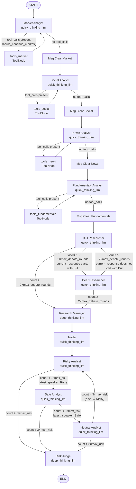
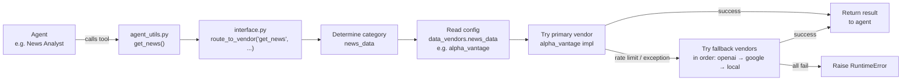

# TradingAgents — Architecture Reference

Full reference for new developers. See [docs/quickstart.md](quickstart.md) for the one-page overview.

---

## 1. Agent Pipeline

Each agent is a LangGraph node — a Python function that receives the current state, does work, and returns state updates. Agents are wired together by `GraphSetup.setup_graph()` in `tradingagents/graph/setup.py`.

### LLMs

Two LLM instances are created in `TradingAgentsGraph.__init__()` (`tradingagents/graph/trading_graph.py:75`):

| Name | Config key | Default | Used for |
|------|-----------|---------|----------|
| `quick_thinking_llm` | `"quick_think_llm"` | `gpt-4o-mini` | All analysts, researchers, trader, risk analysts |
| `deep_thinking_llm` | `"deep_think_llm"` | `o4-mini` | Research Manager, Risk Judge |

### Analyst Team

Analysts run **sequentially** (Market → Social → News → Fundamentals). Each analyst loops on tool calls until it has all the data it needs, then writes its report and clears its messages from the shared state.

| Agent | Node name | LLM | Tools called | Output field |
|-------|-----------|-----|-------------|--------------|
| Market Analyst | `"Market Analyst"` | quick | `get_stock_data`, `get_all_indicators` | `market_report` |
| Social Media Analyst | `"Social Analyst"` | quick | `get_news` | `sentiment_report` |
| News Analyst | `"News Analyst"` | quick | `get_news`, `get_global_news`, `get_insider_sentiment`, `get_insider_transactions` | `news_report` |
| Fundamentals Analyst | `"Fundamentals Analyst"` | quick | `get_fundamentals`, `get_balance_sheet`, `get_cashflow`, `get_income_statement` | `fundamentals_report` |

Source files: `tradingagents/agents/analysts/`

**Tool call loop:** Each analyst uses a conditional edge — a routing function that inspects state and returns the name of the next node to execute — (`ConditionalLogic.should_continue_<type>` in `tradingagents/graph/conditional_logic.py`). If the last message has `tool_calls`, execution goes to `tools_<type>` (a `ToolNode`) and back to the analyst. Otherwise it goes to `Msg Clear <Type>`, which deletes the analyst's messages from the shared `messages` list, then passes to the next analyst.

### Researcher Team (Debate)

After all analysts finish, the Bull and Bear Researchers debate over the reports.

| Agent | Node name | LLM | Memory | Output fields |
|-------|-----------|-----|--------|---------------|
| Bull Researcher | `"Bull Researcher"` | quick | `bull_memory` | `investment_debate_state.bull_history` |
| Bear Researcher | `"Bear Researcher"` | quick | `bear_memory` | `investment_debate_state.bear_history` |
| Research Manager | `"Research Manager"` | deep | `invest_judge_memory` | `investment_debate_state.judge_decision`, `investment_plan` |

**Debate routing** (`ConditionalLogic.should_continue_debate`):
- If `investment_debate_state["count"] >= 2 × max_debate_rounds` → go to Research Manager
- Else if last response starts with `"Bull"` → go to Bear Researcher (each researcher prefixes their response with their own name, so this determines who spoke last)
- Else → go to Bull Researcher

> **Note:** `ConditionalLogic` accepts `max_debate_rounds` as a constructor parameter, but the current code in `trading_graph.py` instantiates it without passing the config value (`ConditionalLogic()` at line 99). Debate rounds are therefore fixed at 1 regardless of `config["max_debate_rounds"]`. This is a known wiring gap.

Source files: `tradingagents/agents/researchers/`, `tradingagents/agents/managers/research_manager.py`

### Trader

| Agent | Node name | LLM | Memory | Output field |
|-------|-----------|-----|--------|--------------|
| Trader | `"Trader"` | quick | `trader_memory` | `trader_investment_plan` |

Reads `investment_plan` and generates a concrete trading proposal with position sizing rationale.

Source file: `tradingagents/agents/trader/trader.py`

### Risk Management Team (Debate)

Three risk analysts debate the trader's plan in rotation: Risky → Safe → Neutral → Risky → ...

| Agent | Node name | LLM | Memory | Output fields |
|-------|-----------|-----|--------|---------------|
| Risky Analyst | `"Risky Analyst"` | quick | none | `risk_debate_state.risky_history` |
| Safe Analyst | `"Safe Analyst"` | quick | none | `risk_debate_state.safe_history` |
| Neutral Analyst | `"Neutral Analyst"` | quick | none | `risk_debate_state.neutral_history` |
| Risk Judge | `"Risk Judge"` | deep | `risk_manager_memory` | `risk_debate_state.judge_decision`, `final_trade_decision` |

**Risk debate routing** (`ConditionalLogic.should_continue_risk_analysis`):
- If `risk_debate_state["count"] >= 3 × max_risk_discuss_rounds` → go to Risk Judge
- If `latest_speaker` starts with `"Risky"` → go to Safe Analyst
- If `latest_speaker` starts with `"Safe"` → go to Neutral Analyst
- Else → go to Risky Analyst

> **Note:** Like the researcher debate, `ConditionalLogic` accepts `max_risk_discuss_rounds` as a constructor parameter but it is not passed from the config (see the note above). Risk discussion rounds are fixed at 1 regardless of `config["max_risk_discuss_rounds"]`.

Source files: `tradingagents/agents/risk_mgmt/`, `tradingagents/agents/managers/risk_manager.py`

---

## 2. LangGraph State Flow

TradingAgents uses [LangGraph](https://github.com/langchain-ai/langgraph) to wire agents together. LangGraph is a graph execution engine where:
- **Nodes** are Python functions that read and write state
- **Edges** connect nodes in sequence
- **Conditional edges** branch based on state values (used here for tool-call loops and debate cycling)
- **StateGraph** is the graph definition; `.compile()` produces the runnable graph

The graph is compiled once in `TradingAgentsGraph.__init__()` and reused across multiple `propagate()` calls.

### Full Node & Edge Diagram

> **Reading the diagram:** Each researcher and risk analyst prefixes their response text with their own name (e.g., `"Bull Researcher: ..."`, `"Risky Analyst: ..."`). The routing functions use `startswith()` on this prefix to identify who spoke last and determine the next speaker — it is a speaker-identification convention, not a content condition.

### State Objects

Three TypedDicts (defined in `tradingagents/agents/utils/agent_states.py`) are passed through the graph.

#### `AgentState` (the main state)

Extends LangGraph's `MessagesState` (which provides a `messages` list). All analyst reports and sub-states accumulate here as the graph progresses.

| Field | Type | Set by |
|-------|------|--------|
| `messages` | `list[BaseMessage]` | LangGraph (inherited from `MessagesState`) |
| `company_of_interest` | `str` | Propagator (initial) |
| `trade_date` | `str` | Propagator (initial) |
| `sender` | `str` | Each agent on write |
| `market_report` | `str` | Market Analyst |
| `sentiment_report` | `str` | Social Media Analyst |
| `news_report` | `str` | News Analyst |
| `fundamentals_report` | `str` | Fundamentals Analyst |
| `investment_debate_state` | `InvestDebateState` | Bull/Bear Researchers, Research Manager |
| `investment_plan` | `str` | Research Manager |
| `trader_investment_plan` | `str` | Trader |
| `risk_debate_state` | `RiskDebateState` | Risk Analysts, Risk Judge |
| `final_trade_decision` | `str` | Risk Judge |

#### `InvestDebateState`

Tracks the Bull ↔ Bear debate.

| Field | Type | Purpose |
|-------|------|---------|
| `bull_history` | `str` | Full transcript of Bull's arguments |
| `bear_history` | `str` | Full transcript of Bear's arguments |
| `history` | `str` | Combined debate transcript |
| `current_response` | `str` | Last agent's response (used to determine next speaker) |
| `judge_decision` | `str` | Research Manager's synthesis |
| `count` | `int` | Number of debate turns taken |

#### `RiskDebateState`

Tracks the Risky ↔ Safe ↔ Neutral debate.

| Field | Type | Purpose |
|-------|------|---------|
| `risky_history` | `str` | Risky Analyst's argument history |
| `safe_history` | `str` | Safe Analyst's argument history |
| `neutral_history` | `str` | Neutral Analyst's argument history |
| `history` | `str` | Combined debate transcript |
| `latest_speaker` | `str` | Used to determine next speaker in rotation |
| `current_risky_response` | `str` | Most recent Risky Analyst response |
| `current_safe_response` | `str` | Most recent Safe Analyst response |
| `current_neutral_response` | `str` | Most recent Neutral Analyst response |
| `judge_decision` | `str` | Risk Judge's final ruling |
| `count` | `int` | Number of debate turns taken |

---

## 3. Data Layer

Agents call data tools (e.g., `get_news`, `get_stock_data`) defined in `tradingagents/agents/utils/agent_utils.py`. These are thin wrappers that delegate to `tradingagents/dataflows/interface.py`, which selects and calls the right vendor implementation.

### Vendor Routing Flow

### Tool Categories

Tools are grouped into four categories. The `data_vendors` config key sets the vendor for each category; `tool_vendors` overrides at the individual tool level.

| Category key | Description | Tools |
|-------------|-------------|-------|
| `core_stock_apis` | OHLCV price history | `get_stock_data` |
| `technical_indicators` | MACD, RSI, Bollinger Bands, etc. | `get_indicators`, `get_all_indicators` |
| `fundamental_data` | Financial statements | `get_fundamentals`, `get_balance_sheet`, `get_cashflow`, `get_income_statement` |
| `news_data` | News, sentiment, insider activity | `get_news`, `get_global_news`, `get_insider_sentiment`, `get_insider_transactions` |

### Available Vendors per Tool

| Tool | Vendors available |
|------|------------------|
| `get_stock_data` | `alpha_vantage`, `yfinance`, `local` |
| `get_indicators` | `alpha_vantage`, `yfinance`, `local` |
| `get_all_indicators` | `yfinance`, `local` |
| `get_fundamentals` | `alpha_vantage`, `yfinance`, `google`, `openai` |
| `get_balance_sheet` | `alpha_vantage`, `yfinance`, `local` |
| `get_cashflow` | `alpha_vantage`, `yfinance`, `local` |
| `get_income_statement` | `alpha_vantage`, `yfinance`, `local` |
| `get_news` | `alpha_vantage`, `openai`, `google`, `local` |
| `get_global_news` | `google`, `openai`, `local` |
| `get_insider_sentiment` | `local` |
| `get_insider_transactions` | `alpha_vantage`, `yfinance`, `local` |

### Fallback Behavior

`route_to_vendor()` (`tradingagents/dataflows/interface.py:152`) builds a fallback chain:
1. Primary vendor(s) from config are tried first.
2. If a primary vendor raises any exception (including `AlphaVantageRateLimitError`), the next vendor in the chain is tried.
3. If **all vendors fail**, a `RuntimeError` is raised.
4. For single-vendor configs, execution stops after the first success. For comma-separated multi-vendor configs (e.g., `"alpha_vantage,yfinance"`), all are attempted and results are concatenated.

Source file: `tradingagents/dataflows/interface.py`
