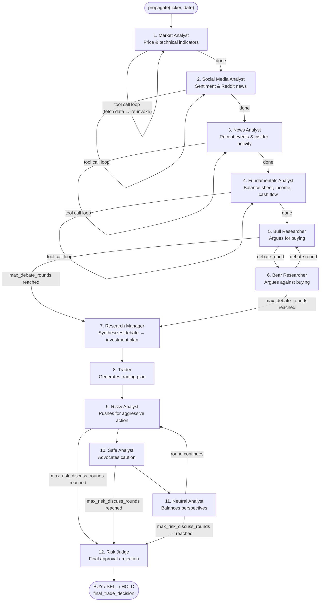

# TradingAgents — Quickstart

TradingAgents is a multi-agent LLM framework that simulates a trading firm's research workflow. A team of specialized AI agents — analysts, researchers, a trader, and risk managers — collaborate through debate and synthesis to produce a **BUY**, **SELL**, or **HOLD** decision for a given stock on a given date.

Entry point: `TradingAgentsGraph.propagate(ticker, date)` in `tradingagents/graph/trading_graph.py`.

## How a Trade Decision Is Made

## Stages

**1–4. Analyst Team (sequential)**
Four analysts run one after another. Each calls external data APIs through tool calls and writes a structured report into the shared state. When an analyst is done fetching data, its messages are cleared from memory to keep the context window clean.

**5–6. Researcher Team (debate)**
The Bull and Bear Researchers read all four analyst reports and debate `max_debate_rounds` times (default: 1 cycle each = 2 turns total). Each round, the last speaker's identity determines who goes next.

**7. Research Manager**
Reads the full debate history and synthesizes a final investment recommendation (`investment_plan`). Uses the more capable `deep_think_llm`.

**8. Trader**
Reads the investment plan and produces a concrete trading proposal (`trader_investment_plan`) including position sizing rationale.

**9–11. Risk Management Team (debate)**
Three risk analysts — Risky, Safe, and Neutral — debate the trader's plan for `max_risk_discuss_rounds` cycles (default: 1 = 3 turns, one per analyst). Order is always Risky → Safe → Neutral → repeat.

**12. Risk Judge**
Reads the full risk debate and issues the final decision (`final_trade_decision`). Uses `deep_think_llm`. The raw text is then processed by `SignalProcessor` to extract the BUY/SELL/HOLD signal.

---

→ For full details on agents, state, data vendors, and configuration: [docs/architecture.md](architecture.md)
