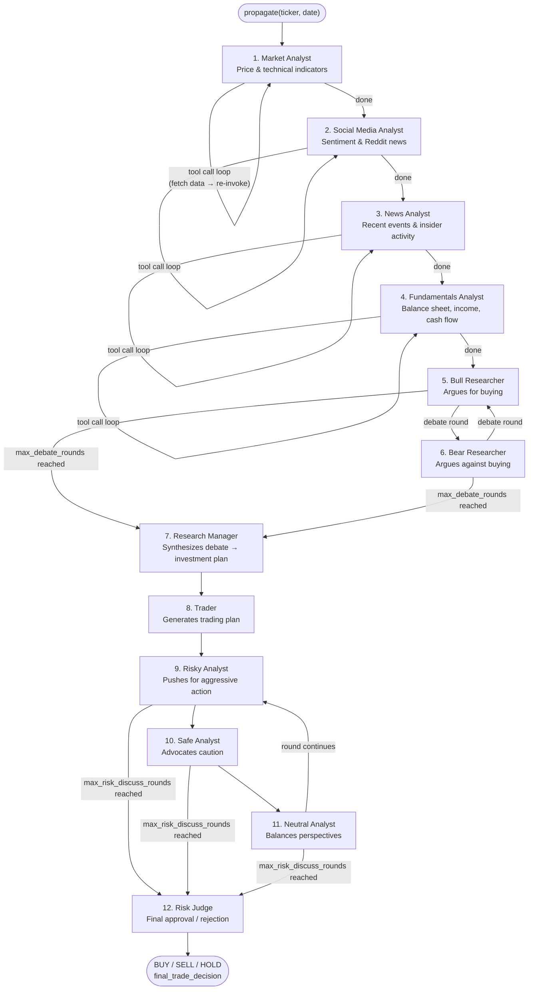
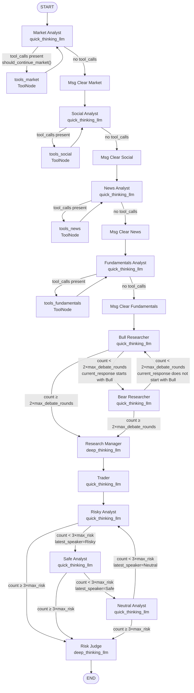
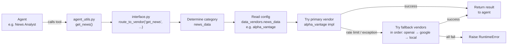

# TradingAgents Documentation Implementation Plan

> **For agentic workers:** REQUIRED SUB-SKILL: Use superpowers:subagent-driven-development (recommended) or superpowers:executing-plans to implement this plan task-by-task. Steps use checkbox (`- [ ]`) syntax for tracking.

**Goal:** Produce `docs/quickstart.md` (narrative overview + flowchart) and `docs/architecture.md` (full reference with 6 sections and 3 Mermaid diagrams) for new developer onboarding.

**Architecture:** Two standalone Markdown files in `docs/`. `quickstart.md` is a single-page entry point; `architecture.md` is the full reference. Built incrementally, one section per commit.

**Tech Stack:** Markdown, Mermaid diagrams (rendered by GitHub / most editors). No code changes — documentation only.

---

## File Map

| Action | File | Contents |
|--------|------|----------|
| Create | `docs/quickstart.md` | Intro, end-to-end Mermaid pipeline flowchart, stage summaries, pointer to architecture.md |
| Create | `docs/architecture.md` | 6 sections: Agent Pipeline, LangGraph State Flow, Data Layer, Configuration, Memory & Reflection, Key File Map |

---

## Task 1: Create `docs/quickstart.md`

**Files:**
- Create: `docs/quickstart.md`

- [ ] **Step 1: Write `docs/quickstart.md`**

Write the following content exactly:

````markdown
# TradingAgents — Quickstart

TradingAgents is a multi-agent LLM framework that simulates a trading firm's research workflow. A team of specialized AI agents — analysts, researchers, a trader, and risk managers — collaborate through debate and synthesis to produce a **BUY**, **SELL**, or **HOLD** decision for a given stock on a given date.

Entry point: `TradingAgentsGraph.propagate(ticker, date)` in `tradingagents/graph/trading_graph.py`.

## How a Trade Decision Is Made



## Stages

**1–4. Analyst Team (sequential)**
Four analysts run one after another. Each calls external data APIs through tool calls and writes a structured report into the shared state. When an analyst is done fetching data, its messages are cleared from memory to keep the context window clean.

**5–6. Researcher Team (debate)**
The Bull and Bear Researchers read all four analyst reports and debate `max_debate_rounds` times (default: 1 cycle each = 2 turns total). Each round, the last speaker's identity determines who goes next.

**7. Research Manager**
Reads the full debate history and synthesizes a final investment recommendation (`investment_plan`). Uses the more capable `deep_think_llm`.

**8. Trader**
Reads the investment plan and produces a concrete trading proposal (`trader_investment_plan`) including position sizing rationale.

**9–11. Risk Management Team (debate)**
Three risk analysts — Risky, Safe, and Neutral — debate the trader's plan for `max_risk_discuss_rounds` cycles (default: 1 = 3 turns, one per analyst). Order is always Risky → Safe → Neutral → repeat.

**12. Risk Judge**
Reads the full risk debate and issues the final decision (`final_trade_decision`). Uses `deep_think_llm`. The raw text is then processed by `SignalProcessor` to extract the BUY/SELL/HOLD signal.

---

→ For full details on agents, state, data vendors, and configuration: [docs/architecture.md](architecture.md)
````

- [ ] **Step 2: Verify the Mermaid diagram node labels match reality**

Run the following and confirm agent names match the graph node names in `setup.py`:

```bash
grep "add_node" tradingagents/graph/setup.py
```

Expected output includes lines like:
```
workflow.add_node("Bull Researcher", bull_researcher_node)
workflow.add_node("Bear Researcher", bear_researcher_node)
workflow.add_node("Research Manager", research_manager_node)
workflow.add_node("Trader", trader_node)
workflow.add_node("Risky Analyst", risky_analyst)
workflow.add_node("Neutral Analyst", neutral_analyst)
workflow.add_node("Safe Analyst", safe_analyst)
workflow.add_node("Risk Judge", risk_manager_node)
```

- [ ] **Step 3: Commit**

```bash
git add docs/quickstart.md
git commit -m "docs: add quickstart overview with end-to-end pipeline flowchart"
```

---

## Task 2: Create `docs/architecture.md` — Sections 1 (Agent Pipeline)

**Files:**
- Create: `docs/architecture.md`

- [ ] **Step 1: Write `docs/architecture.md` with header and Section 1**

Write the following content exactly:

````markdown
# TradingAgents — Architecture Reference

Full reference for new developers. See [docs/quickstart.md](quickstart.md) for the one-page overview.

---

## 1. Agent Pipeline

Each agent is a LangGraph node — a Python function that receives the current state, does work, and returns state updates. Agents are wired together by `GraphSetup.setup_graph()` in `tradingagents/graph/setup.py`.

### LLMs

Two LLM instances are created in `TradingAgentsGraph.__init__()` (`tradingagents/graph/trading_graph.py:76`):

| Name | Config key | Default | Used for |
|------|-----------|---------|----------|
| `quick_thinking_llm` | `"quick_think_llm"` | `gpt-4o-mini` | All analysts, researchers, trader, risk analysts |
| `deep_thinking_llm` | `"deep_think_llm"` | `o4-mini` | Research Manager, Risk Judge |

### Analyst Team

Analysts run **sequentially** (Market → Social → News → Fundamentals). Each analyst loops on tool calls until it has all the data it needs, then writes its report and clears its messages from the shared state.

| Agent | Node name | LLM | Tools called | Output field |
|-------|-----------|-----|-------------|--------------|
| Market Analyst | `"Market Analyst"` | quick | `get_stock_data`, `get_all_indicators` | `market_report` |
| Social Media Analyst | `"Social Analyst"` | quick | `get_news` | `sentiment_report` |
| News Analyst | `"News Analyst"` | quick | `get_news`, `get_global_news`, `get_insider_sentiment`, `get_insider_transactions` | `news_report` |
| Fundamentals Analyst | `"Fundamentals Analyst"` | quick | `get_fundamentals`, `get_balance_sheet`, `get_cashflow`, `get_income_statement` | `fundamentals_report` |

Source files: `tradingagents/agents/analysts/`

**Tool call loop:** Each analyst uses a conditional edge (`ConditionalLogic.should_continue_<type>` in `tradingagents/graph/conditional_logic.py`). If the last message has `tool_calls`, execution goes to `tools_<type>` (a `ToolNode`) and back to the analyst. Otherwise it goes to `Msg Clear <Type>`, which deletes the analyst's messages from the shared `messages` list, then passes to the next analyst.

### Researcher Team (Debate)

After all analysts finish, the Bull and Bear Researchers debate over the reports.

| Agent | Node name | LLM | Memory | Output fields |
|-------|-----------|-----|--------|---------------|
| Bull Researcher | `"Bull Researcher"` | quick | `bull_memory` | `investment_debate_state.bull_history` |
| Bear Researcher | `"Bear Researcher"` | quick | `bear_memory` | `investment_debate_state.bear_history` |
| Research Manager | `"Research Manager"` | deep | `invest_judge_memory` | `investment_debate_state.judge_decision`, `investment_plan` |

**Debate routing** (`ConditionalLogic.should_continue_debate`):
- If `investment_debate_state["count"] >= 2 × max_debate_rounds` → go to Research Manager
- Else if last response starts with `"Bull"` → go to Bear Researcher
- Else → go to Bull Researcher

Source files: `tradingagents/agents/researchers/`, `tradingagents/agents/managers/research_manager.py`

### Trader

| Agent | Node name | LLM | Memory | Output field |
|-------|-----------|-----|--------|--------------|
| Trader | `"Trader"` | quick | `trader_memory` | `trader_investment_plan` |

Reads `investment_plan` and generates a concrete trading proposal with position sizing rationale.

Source file: `tradingagents/agents/trader/trader.py`

### Risk Management Team (Debate)

Three risk analysts debate the trader's plan in rotation: Risky → Safe → Neutral → Risky → ...

| Agent | Node name | LLM | Output fields |
|-------|-----------|-----|---------------|
| Risky Analyst | `"Risky Analyst"` | quick | `risk_debate_state.risky_history` |
| Safe Analyst | `"Safe Analyst"` | quick | `risk_debate_state.safe_history` |
| Neutral Analyst | `"Neutral Analyst"` | quick | `risk_debate_state.neutral_history` |
| Risk Judge | `"Risk Judge"` | deep | `risk_debate_state.judge_decision`, `final_trade_decision` |

**Risk debate routing** (`ConditionalLogic.should_continue_risk_analysis`):
- If `risk_debate_state["count"] >= 3 × max_risk_discuss_rounds` → go to Risk Judge
- If `latest_speaker` starts with `"Risky"` → go to Safe Analyst
- If `latest_speaker` starts with `"Safe"` → go to Neutral Analyst
- Else → go to Risky Analyst

Source files: `tradingagents/agents/risk_mgmt/`, `tradingagents/agents/managers/risk_manager.py`
````

- [ ] **Step 2: Cross-check node names and LLM assignments**

```bash
grep -A2 "create_market_analyst\|create_social_media_analyst\|create_news_analyst\|create_fundamentals_analyst\|create_bull_researcher\|create_bear_researcher\|create_research_manager\|create_trader\|create_risky_debator\|create_safe_debator\|create_neutral_debator\|create_risk_manager" tradingagents/graph/setup.py
```

Confirm: `research_manager_node` and `risk_manager_node` use `self.deep_thinking_llm`; all others use `self.quick_thinking_llm`.

- [ ] **Step 3: Commit**

```bash
git add docs/architecture.md
git commit -m "docs: add architecture.md section 1 — agent pipeline"
```

---

## Task 3: Add Section 2 (LangGraph State Flow) to `docs/architecture.md`

**Files:**
- Modify: `docs/architecture.md` (append section)

- [ ] **Step 1: Append Section 2 to `docs/architecture.md`**

Append the following block at the end of the file:

````markdown

---

## 2. LangGraph State Flow

TradingAgents uses [LangGraph](https://github.com/langchain-ai/langgraph) to wire agents together. LangGraph is a graph execution engine where:
- **Nodes** are Python functions that read and write state
- **Edges** connect nodes in sequence
- **Conditional edges** branch based on state values (used here for tool-call loops and debate cycling)
- **StateGraph** is the graph definition; `.compile()` produces the runnable graph

The graph is compiled once in `TradingAgentsGraph.__init__()` and reused across multiple `propagate()` calls.

### Full Node & Edge Diagram



### State Objects

Three TypedDicts (defined in `tradingagents/agents/utils/agent_states.py`) are passed through the graph.

#### `AgentState` (the main state)

Extends LangGraph's `MessagesState` (which provides a `messages` list). All analyst reports and sub-states accumulate here as the graph progresses.

| Field | Type | Set by |
|-------|------|--------|
| `company_of_interest` | `str` | Propagator (initial) |
| `trade_date` | `str` | Propagator (initial) |
| `sender` | `str` | Each agent on write |
| `market_report` | `str` | Market Analyst |
| `sentiment_report` | `str` | Social Media Analyst |
| `news_report` | `str` | News Analyst |
| `fundamentals_report` | `str` | Fundamentals Analyst |
| `investment_debate_state` | `InvestDebateState` | Bull/Bear Researchers, Research Manager |
| `investment_plan` | `str` | Research Manager |
| `trader_investment_plan` | `str` | Trader |
| `risk_debate_state` | `RiskDebateState` | Risk Analysts, Risk Judge |
| `final_trade_decision` | `str` | Risk Judge |

#### `InvestDebateState`

Tracks the Bull ↔ Bear debate.

| Field | Type | Purpose |
|-------|------|---------|
| `bull_history` | `str` | Full transcript of Bull's arguments |
| `bear_history` | `str` | Full transcript of Bear's arguments |
| `history` | `str` | Combined debate transcript |
| `current_response` | `str` | Last agent's response (used to determine next speaker) |
| `judge_decision` | `str` | Research Manager's synthesis |
| `count` | `int` | Number of debate turns taken |

#### `RiskDebateState`

Tracks the Risky ↔ Safe ↔ Neutral debate.

| Field | Type | Purpose |
|-------|------|---------|
| `risky_history` | `str` | Risky Analyst's argument history |
| `safe_history` | `str` | Safe Analyst's argument history |
| `neutral_history` | `str` | Neutral Analyst's argument history |
| `history` | `str` | Combined debate transcript |
| `latest_speaker` | `str` | Used to determine next speaker in rotation |
| `current_risky_response` | `str` | Most recent Risky Analyst response |
| `current_safe_response` | `str` | Most recent Safe Analyst response |
| `current_neutral_response` | `str` | Most recent Neutral Analyst response |
| `judge_decision` | `str` | Risk Judge's final ruling |
| `count` | `int` | Number of debate turns taken |
````

- [ ] **Step 2: Verify state field names against source**

```bash
grep -A2 "Annotated" tradingagents/agents/utils/agent_states.py
```

Confirm all field names in the tables above match the TypedDict definitions exactly.

- [ ] **Step 3: Commit**

```bash
git add docs/architecture.md
git commit -m "docs: add architecture.md section 2 — LangGraph state flow and state objects"
```

---

## Task 4: Add Section 3 (Data Layer) to `docs/architecture.md`

**Files:**
- Modify: `docs/architecture.md` (append section)

- [ ] **Step 1: Append Section 3 to `docs/architecture.md`**

Append the following block at the end of the file:

````markdown

---

## 3. Data Layer

Agents call data tools (e.g., `get_news`, `get_stock_data`) defined in `tradingagents/agents/utils/agent_utils.py`. These are thin wrappers that delegate to `tradingagents/dataflows/interface.py`, which selects and calls the right vendor implementation.

### Vendor Routing Flow



### Tool Categories

Tools are grouped into four categories. The `data_vendors` config key sets the vendor for each category; `tool_vendors` overrides at the individual tool level.

| Category key | Description | Tools |
|-------------|-------------|-------|
| `core_stock_apis` | OHLCV price history | `get_stock_data` |
| `technical_indicators` | MACD, RSI, Bollinger Bands, etc. | `get_indicators`, `get_all_indicators` |
| `fundamental_data` | Financial statements | `get_fundamentals`, `get_balance_sheet`, `get_cashflow`, `get_income_statement` |
| `news_data` | News, sentiment, insider activity | `get_news`, `get_global_news`, `get_insider_sentiment`, `get_insider_transactions` |

### Available Vendors per Tool

| Tool | Vendors available |
|------|------------------|
| `get_stock_data` | `alpha_vantage`, `yfinance`, `local` |
| `get_indicators` | `alpha_vantage`, `yfinance`, `local` |
| `get_all_indicators` | `yfinance`, `local` |
| `get_fundamentals` | `alpha_vantage`, `yfinance`, `google`, `openai` |
| `get_balance_sheet` | `alpha_vantage`, `yfinance`, `local` |
| `get_cashflow` | `alpha_vantage`, `yfinance`, `local` |
| `get_income_statement` | `alpha_vantage`, `yfinance`, `local` |
| `get_news` | `alpha_vantage`, `openai`, `google`, `local` |
| `get_global_news` | `google`, `openai`, `local` |
| `get_insider_sentiment` | `local` |
| `get_insider_transactions` | `alpha_vantage`, `yfinance`, `local` |

### Fallback Behavior

`route_to_vendor()` (`tradingagents/dataflows/interface.py:152`) builds a fallback chain:
1. Primary vendor(s) from config are tried first.
2. If a primary vendor raises any exception (including `AlphaVantageRateLimitError`), the next vendor in the chain is tried.
3. If **all vendors fail**, a `RuntimeError` is raised.
4. For single-vendor configs, execution stops after the first success. For comma-separated multi-vendor configs (e.g., `"alpha_vantage,yfinance"`), all are attempted and results are concatenated.

Source file: `tradingagents/dataflows/interface.py`
````

- [ ] **Step 2: Verify vendor table against source**

```bash
grep -A3 "get_news" tradingagents/dataflows/interface.py | head -20
```

Confirm the vendor lists in the table match the keys in `VENDOR_METHODS` dict in `interface.py`.

- [ ] **Step 3: Commit**

```bash
git add docs/architecture.md
git commit -m "docs: add architecture.md section 3 — data layer and vendor routing"
```

---

## Task 5: Add Sections 4–6 (Config, Memory, Key File Map) to `docs/architecture.md`

**Files:**
- Modify: `docs/architecture.md` (append sections)

- [ ] **Step 1: Append Sections 4–6 to `docs/architecture.md`**

Append the following block at the end of the file:

````markdown

---

## 4. Configuration

All runtime settings live in `DEFAULT_CONFIG` in `tradingagents/default_config.py`. Pass a modified copy to `TradingAgentsGraph(config=...)` to override any value.

```python
from tradingagents.graph.trading_graph import TradingAgentsGraph
from tradingagents.default_config import DEFAULT_CONFIG

config = {**DEFAULT_CONFIG, "max_debate_rounds": 3, "llm_provider": "anthropic"}
graph = TradingAgentsGraph(config=config)
```

### Config Fields

| Key | Default | Description |
|-----|---------|-------------|
| `"llm_provider"` | `"openai"` | LLM backend. Options: `"openai"`, `"anthropic"`, `"google"`, `"openrouter"`, `"ollama"` |
| `"deep_think_llm"` | `"o4-mini"` | Model name for Research Manager and Risk Judge |
| `"quick_think_llm"` | `"gpt-4o-mini"` | Model name for all other agents |
| `"backend_url"` | `"https://api.openai.com/v1"` | API base URL (useful for local models via Ollama or OpenRouter) |
| `"max_debate_rounds"` | `1` | Bull↔Bear debate cycles. `1` = 2 turns total (one each). Count exits when `count >= 2 × max_debate_rounds`. |
| `"max_risk_discuss_rounds"` | `1` | Risk team cycles. `1` = 3 turns total (one per analyst). Count exits when `count >= 3 × max_risk_discuss_rounds`. |
| `"max_recur_limit"` | `100` | LangGraph recursion limit — prevents infinite loops |
| `"data_vendors"` | see below | Category-level vendor config |
| `"tool_vendors"` | `{}` | Tool-level vendor overrides (take precedence over `data_vendors`) |

### Default Data Vendors

```python
"data_vendors": {
    "core_stock_apis": "yfinance",
    "technical_indicators": "yfinance",
    "fundamental_data": "alpha_vantage",
    "news_data": "alpha_vantage",
}
```

### Required Environment Variables

Set these in `.env` (copy `.env.example` as a starting point):

| Variable | Required when |
|----------|--------------|
| `OPENAI_API_KEY` | `llm_provider = "openai"` (default) |
| `ANTHROPIC_API_KEY` | `llm_provider = "anthropic"` |
| `GOOGLE_API_KEY` | `llm_provider = "google"` |
| `ALPHA_VANTAGE_API_KEY` | `data_vendors` includes `"alpha_vantage"` |
| `ALPACA_API_KEY`, `ALPACA_SECRET_KEY` | Live/paper trading via `trade.py` |

---

## 5. Memory & Reflection

Each of the five reasoning agents (Bull Researcher, Bear Researcher, Research Manager, Trader, Risk Judge) has a dedicated `FinancialSituationMemory` instance backed by an **in-memory ChromaDB collection**. Memories are stored as vector embeddings and retrieved by semantic similarity.

**Memory instances** (created in `TradingAgentsGraph.__init__()`, `tradingagents/graph/trading_graph.py:89`):

| Variable | Used by |
|----------|---------|
| `bull_memory` | Bull Researcher |
| `bear_memory` | Bear Researcher |
| `invest_judge_memory` | Research Manager |
| `trader_memory` | Trader |
| `risk_manager_memory` | Risk Judge |

**How agents use memory:** Before generating their response, each memory-backed agent queries its collection for past situations similar to the current one. Retrieved lessons are injected into the prompt as additional context.

**Updating memory — `reflect_and_remember(returns_losses)`** (`tradingagents/graph/trading_graph.py:238`):

Call this **after** you know the outcome of a trade (profit or loss). It triggers `Reflector` to generate a lesson for each agent's decision in that trade and writes it to that agent's ChromaDB collection. On the next run for a similar situation, the agent will retrieve and learn from that lesson.

```python
# After receiving trade outcome:
graph.reflect_and_remember(returns_losses={"returns": 0.03, "losses": 0.0})
```

Source files: `tradingagents/agents/utils/memory.py`, `tradingagents/graph/reflection.py`

**Note:** ChromaDB is in-memory by default — memories do not persist across Python process restarts unless you configure persistent storage in `FinancialSituationMemory`.

---

## 6. Key File Map

| File | Purpose | Key symbol |
|------|---------|------------|
| `tradingagents/graph/trading_graph.py` | Main orchestrator — initializes LLMs, memories, tool nodes, and graph | `TradingAgentsGraph`, `propagate()` |
| `tradingagents/graph/setup.py` | Builds and compiles the LangGraph `StateGraph` | `GraphSetup.setup_graph()` |
| `tradingagents/graph/conditional_logic.py` | Routing decisions — tool-call loops and debate cycling | `ConditionalLogic` |
| `tradingagents/graph/propagation.py` | Creates the initial `AgentState` for each `propagate()` call | `Propagator.create_initial_state()` |
| `tradingagents/graph/reflection.py` | Post-trade learning — generates lessons and writes to memory | `Reflector` |
| `tradingagents/graph/signal_processing.py` | Extracts BUY/SELL/HOLD from raw LLM output | `SignalProcessor.process_signal()` |
| `tradingagents/agents/utils/agent_states.py` | TypedDict definitions for all state objects | `AgentState`, `InvestDebateState`, `RiskDebateState` |
| `tradingagents/agents/utils/agent_utils.py` | Tool wrappers called by agents (delegates to `interface.py`) | `get_stock_data`, `get_news`, etc. |
| `tradingagents/agents/utils/memory.py` | ChromaDB-backed semantic memory | `FinancialSituationMemory` |
| `tradingagents/agents/analysts/` | Four analyst agent implementations | `create_market_analyst()`, etc. |
| `tradingagents/agents/researchers/` | Bull and Bear researcher implementations | `create_bull_researcher()`, etc. |
| `tradingagents/agents/managers/` | Research Manager and Risk Manager implementations | `create_research_manager()`, etc. |
| `tradingagents/agents/risk_mgmt/` | Risky, Safe, Neutral debator implementations | `create_risky_debator()`, etc. |
| `tradingagents/agents/trader/trader.py` | Trader agent implementation | `create_trader()` |
| `tradingagents/dataflows/interface.py` | Vendor routing with fallback | `route_to_vendor()` |
| `tradingagents/dataflows/config.py` | Thread-local config store shared across the dataflow layer | `get_config()`, `set_config()` |
| `tradingagents/default_config.py` | Single source of truth for all runtime settings | `DEFAULT_CONFIG` |
| `cli/main.py` | Interactive CLI using Rich + questionary | `main()` |
| `main.py` | Programmatic example — run analysis directly | — |
````

- [ ] **Step 2: Verify config fields against source**

```bash
cat tradingagents/default_config.py
```

Confirm all keys documented in the config table are present in `DEFAULT_CONFIG`. Confirm default values match.

- [ ] **Step 3: Verify file map entries exist**

```bash
ls tradingagents/agents/analysts/ tradingagents/agents/researchers/ tradingagents/agents/managers/ tradingagents/agents/risk_mgmt/
```

Confirm all directories and key files listed in the file map exist.

- [ ] **Step 4: Commit**

```bash
git add docs/architecture.md
git commit -m "docs: add architecture.md sections 4-6 — config, memory, key file map"
```

---

## Self-Review

### Spec Coverage Check

| Spec requirement | Covered by |
|-----------------|------------|
| `docs/quickstart.md` — intro + flowchart + stage summaries | Task 1 |
| `docs/architecture.md` — Section 1: Agent Pipeline | Task 2 |
| `docs/architecture.md` — Section 2: LangGraph State Flow | Task 3 |
| `docs/architecture.md` — Section 3: Data Layer | Task 4 |
| `docs/architecture.md` — Section 4: Configuration | Task 5 |
| `docs/architecture.md` — Section 5: Memory & Reflection | Task 5 |
| `docs/architecture.md` — Section 6: Key File Map | Task 5 |
| Mermaid `graph TD` for pipelines | Task 1 (quickstart), Task 3 (LangGraph) |
| Mermaid `graph LR` for data routing | Task 4 |
| New-dev audience: LangGraph terms defined on first use | Task 3, Section 2 intro |
| `file:line` code references | Tasks 2, 3, 4, 5 throughout |
| Out of scope: `trade.py`, `test.py`, vendor internals | Not included in any task |

All spec requirements covered. No gaps found.
